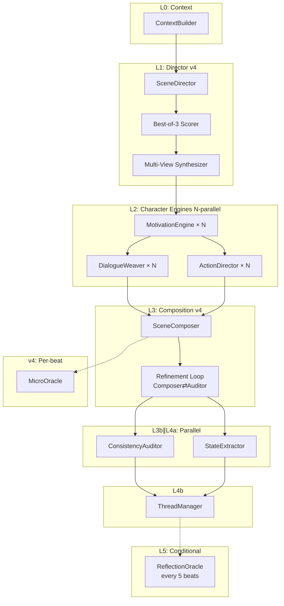

# MaNA v4 — Multi-Agent Narrative Architecture (Python Port)

Python port of the Rain project's core LLM narrative pipeline, originally written in GDScript for Godot 4.x.

Source of Inspiration:
https://toonflow.net/#/
|
https://github.com/HBAI-Ltd/Toonflow-app

## Architecture



## Three-Tier Model Assignment

| Tier | Agents | Default Model |
|------|--------|--------------|
| **strong** | Director, Composer, Oracle | qwen3.5:9b |
| **medium** | Motivation, Dialogue, Auditor, Thread, Synthesizer | qwen3.5:9b |
| **light** | Action, Extractor, Scorer, MicroOracle | qwen3.5:9b |

## Quick Start

```bash
# Install dependencies
pip install aiohttp configparser

# Run a beat
python -c "
import asyncio
from src_py.pipeline import MananaPipeline

async def main():
    pipe = MananaPipeline()
    await pipe.initialize()
    
    world_state = {
        'game_time': '午夜',
        'player_location': '图书馆',
        'player_profile': {'traits': ['好奇心强'], 'motivation': '探索', 'tendency': '中立'},
        'player_reputation': {},
        'characters_state': {
            'char_001': {'location': '图书馆', 'mood': '中性', 'goal': ''},
        },
        'active_threads': [{
            'id': 'thread_001', 'title': '失踪的导师',
            'type': 'main', 'progress': 0.3, 'tension': 0.5,
            'question': '导师去了哪里？', 'involved_characters': ['char_001'],
            'player_attention': 0.7, 'priority': 0.8,
        }],
        'canon': {
            'characters': [{
                'id': 'char_001', 'name': '老馆长',
                'personality': '沉默寡言，知识渊博',
                'role': '图书馆馆长',
            }],
            'locations': [{
                'id': '图书馆', 'name': '图书馆',
                'description': '古老的图书馆，书架高耸入云',
                'atmosphere': '神秘',
            }],
        },
        'narrative_history': [],
        'scene_memory': [],
        'long_term_memory': [],
        'world_divergence': 0.2,
        'custom_world_rules': [],
        'knowledge_graph': {},
        'dynamic_npcs': {},
        'thread_pool_config': {
            'max_active_main': 1, 'max_active_side': 2, 'max_child_threads': 5,
        },
    }
    
    result = await pipe.run_beat('玩家走向图书馆深处', world_state)
    print(result['narrative_text'])
    await pipe.cleanup()

asyncio.run(main())
"
```

## File Structure

```
src_py/
├── __init__.py          # Package marker, version
├── config.py            # MananaConfig — INI config reader
├── schema.py            # MananaSchema — data contracts + validators
├── base_agent.py        # BaseAgent — abstract agent base class
├── agents.py            # All 12 agent implementations
├── providers.py         # Provider abstraction + Ollama/OpenAI/DeepSeek
├── pipeline.py          # MananaPipeline — main orchestrator
├── utils.py             # JSON parsing, logging, retry helpers
└── manana_config.cfg    # Default configuration (INI format)
```

## Configuration

The `manana_config.cfg` file is INI-format, backward-compatible with the Godot version.
Three provider tiers (`[provider_strong]`, `[provider_medium]`, `[provider_light]`) each specify:

- `type`: ollama | openai | deepseek
- `endpoint`: API endpoint URL
- `api_key`: API key (leave empty for Ollama)
- `model`: Model name
- `temperature`: 0.0–2.0
- `max_tokens`: Maximum generation tokens
- `timeout`: Request timeout in seconds

### v4 Feature Toggles

```ini
[v4]
enabled = true           # Global v4 enable/disable

[refinement]
enabled = true           # Composer refinement loop

[best_of_3]
enabled = true           # Best-of-3 Director with Scorer

[multi_view]
enabled = false          # Multi-view Director (plot + character)

[dynamic_tier]
enabled = false          # Dynamic tier assignment by complexity

[micro_oracle]
enabled = true           # Per-beat quality feedback

[semantic_selection]
enabled = false          # Canon semantic selection

[memory]
enable_vector_memory = false  # Vector memory retrieval
```

## Prompts

Prompt `.md` files should be placed in a `prompts/` directory relative to the config file.
Expected files: `director.md`, `motivation.md`, `dialogue_weaver.md`, `action_director.md`,
`composer.md`, `auditor.md`, `state_extractor.md`, `thread_manager.md`, `oracle.md`,
`director_plot.md`, `director_char.md`.

If prompt files are not found, agents fall back to their built-in default prompts.

## Key Differences from GDScript Version

| Aspect | GDScript | Python |
|--------|----------|--------|
| Async model | `await` on Godot signals | `asyncio` + `aiohttp` |
| Parallel execution | Worker coroutines + `process_frame` polling | `asyncio.gather()` |
| HTTP | `HTTPRequest` node | `aiohttp.ClientSession` |
| Config | `ConfigFile` | `configparser` |
| JSON | `JSON.new().parse()` | `json.loads()` |
| Logging | `print()` / `push_warning()` | `logging` module |
| WorldState | Godot Autoload (Node) | Plain Python `dict` |

## Dependencies

- Python 3.10+
- `aiohttp` — async HTTP client
- Standard library: `asyncio`, `json`, `logging`, `configparser`, `os`, `re`, `copy`

## License

Part of the Round Project — internal use.
