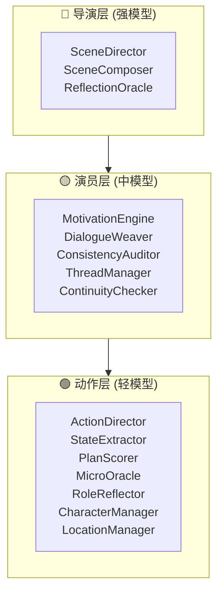

# AI-Driven-Novel-Inference-Framework

> 从完结中文小说中提取世界观与角色，驱动多 Agent LLM 管线，实现 AI 交互式叙事引擎。

---

## 架构总览

https://github.com/Pegasus-pure/AI-Driven-Novel-Inference-Framework/blob/main(frame-work)/Agent-Edit.html

```

### 三级模型分层



---

## 核心特性

| 模块 | 说明 |
|------|------|
| **小说 Canon 抽取** | 支持 LLM + 正则双模式，从 `.txt` 提取角色/地点/世界观/时间线 |
| **MaNA v4 叙事管线** | 5 层多 Agent 协作：Context → Director → Characters → Composer → Auditor/Extractor → Threads → Oracle |
| **涌现系统** | 检测不在 Canon 中的新角色/地点，累计命中后 LLM 判定采纳 |
| **连续叙事审计** | ContinuityChecker 检测逻辑冲突，支持重做（上限 2 次） |
| **角色过渡反思** | RoleReflector 检测状态跳跃，生成过渡叙述 |
| **三因子记忆** | recency + relevance + importance 加权检索 |
| **双极偏离度** | -1.0 ~ +1.0 世界状态偏离追踪 |
| **冲突种子池** | 冲突事件存储与分配合并 |
| **多存档槽位** | 3 槽位 JSON 存档，含完整叙事历史 + 记忆流 |
| **实时状态显示** | WebSocket 驱动的 Pipeline 状态标签 + 打字机效果 |

---

## 技术栈

| 层 | 技术 |
|----|------|
| 后端框架 | Python 3.10+ / FastAPI / uvicorn |
| LLM 后端 | Ollama (OpenAI / DeepSeek 可选) |
| 实时通信 | WebSocket (aiohttp) |
| 前端 | 原生 HTML/CSS/JS (零框架) |
| 配置 | YAML (PyYAML) |
| 状态机 | 客户端 UnifiedFSM |
| 构建 | pyinstaller (桌面打包) / pywebview |

---

## 快速启动

### 环境要求

- Python 3.10+
- Ollama 服务（或其他 OpenAI 兼容 API）

### 安装

```bash
git clone <repo-url>
cd AI-Driven-Novel-Inference-Framework
pip install -r requirements.txt
```

### 配置

编辑 `config.yaml`，填入你的 LLM 后端：

```yaml
providers:
  导演层:
    type: ollama          # ollama | openai | deepseek
    endpoint: http://localhost:11434
    model: ""             # 填入你的模型名
  演员层:
    type: ollama
    endpoint: http://localhost:11434
    model: ""
  动作层:
    type: ollama
    endpoint: http://localhost:11434
    model: ""
```

### 运行

```bash
# Web 模式（推荐）
python launcher.py

# 或直接启动 uvicorn
python -m uvicorn server.main:app --host 127.0.0.1 --port 8000
```

打开浏览器访问 `http://127.0.0.1:8000`

### 使用

1. 将完结的 `.txt` 小说放入 `novel/` 目录
2. 刷新页面，选择小说文件
3. 等待 Canon 抽取完成（LLM 模式需 Ollama 运行中）
4. 点击「开始冒险」进入交互式叙事

或者不导入小说
-编辑世界观
-添加角色
-添加地点
-点击「开始冒险」进入交互式叙事

---

## 项目结构

```
AI-Driven-Novel-Inference-Framework/
├── config.yaml              # 主配置文件
├── launcher.py              # 入口 (Web / 桌面 / 打包)
├── requirements.txt         # Python 依赖
├── server/                  # 后端服务
│   ├── main.py              # FastAPI 入口 + WebSocket
│   ├── game_session.py      # 游戏会话编排
│   ├── novel_loader.py      # 小说加载 + Canon 抽取
│   ├── world_state.py       # 世界状态容器
│   ├── save_manager.py      # 存档管理 (3 槽位)
│   ├── canon_manager.py     # Canon 目录结构管理
│   ├── conflict_pool.py     # 冲突种子池
│   ├── websocket_manager.py # WS 连接管理
│   ├── exceptions.py        # 统一异常层级
│   ├── logging_config.py    # 日志格式化
│   ├── paths.py             # 统一路径定义
│   ├── extractors/          # Canon 提取器
│   │   ├── base.py          # 抽象基类
│   │   ├── regex_extractor.py
│   │   └── llm_extractor.py
│   ├── storage/             # Canon 存储后端
│   │   ├── base.py
│   │   └── file_storage.py
│   └── manana/              # MaNA v4 叙事管线
│       ├── pipeline.py      # 主管线编排 (5 层)
│       ├── agents.py        # 全部 Agent 实现
│       ├── base_agent.py    # Agent 基类
│       ├── config.py        # 配置解析
│       ├── providers.py     # LLM Provider (Ollama/OpenAI/DeepSeek)
│       ├── memory.py        # 三因子记忆系统
│       ├── schema.py        # Schema 验证
│       ├── utils.py         # JSON/日志/重试工具
│       ├── defaults.py      # 默认常量
│       ├── pipeline_context.py
│       ├── pipeline_helpers.py
│       ├── pipeline_state.py
│       └── docs/            # Mermaid 图
├── static/                  # 前端 (零框架)
│   ├── index.html           # 主页面
│   ├── css/main.css         # 完整样式表
│   └── js/                  # 17 个模块
│       ├── app.js           # 主应用入口
│       ├── ws-client.js     # WebSocket 客户端
│       ├── fsm.js           # 统一有限状态机
│       ├── pipeline-status.js
│       ├── narrative.js     # 叙事显示 + 打字机
│       ├── choices.js       # 选项处理
│       ├── characters.js    # 角色面板 + 编辑
│       ├── locations.js     # 地点面板 + 编辑
│       ├── world-rules.js   # 世界观面板
│       ├── log-ui.js        # 事件日志
│       ├── save-ui.js       # 存档管理
│       ├── deviation.js     # 偏离度显示
│       ├── threads.js       # 线索面板
│       ├── panels.js        # 面板切换
│       ├── input.js         # 用户输入
│       └── typewriter.js    # 打字机效果
├── novel/                   # 小说源文件
│   ├── *.txt                # 待抽取小说
│   ├── canon_*.json         # 预生成 Canon
│   └── <novel_name>/        # 运行时目录结构
│       ├── meta.json
│       ├── rules/
│       ├── characters/
│       └── locations/
├── tests/                   # 测试套件
└── docs/                    # 设计文档
```

---

## 配置项速查

| 段 | 用途 |
|----|------|
| `app` | 应用标题、绑定地址、端口 |
| `providers` | 三级模型配置 (type/endpoint/model/temperature) |
| `features` | 功能开关 (emergence/continuity/reflection/memory) |
| `game` | oracle 间隔、自动存档间隔、最大重连次数 |
| `emergence` | 涌现系统阈值 (命中数 / 相似度) |
| `memory` | 记忆系统参数 (权重/衰减/top_k) |
| `truncation` | 上下文截断长度 |

---

## License

源码仅供学习交流使用。小说版权归原作者所有。

---

> 项目起源于 MaNA v4 (Multi-Agent Narrative Architecture)，灵感来源：[ToonFlow](https://toonflow.net/)
