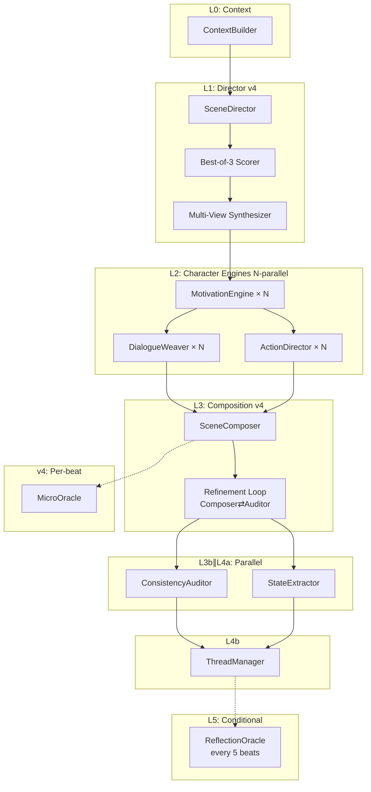

# MaNA v4 — Multi-Agent Narrative Architecture (Python Port)

Python port of the Rain project's core LLM narrative pipeline, originally written in GDScript for Godot 4.x.

Source of Inspiration:
https://toonflow.net/#/
|
https://github.com/HBAI-Ltd/Toonflow-app

## Architecture

## Three-Tier Model Assignment

| Tier | Agents | Default Model |
|------|--------|--------------|
| **strong** | Director, Composer, Oracle | qwen3.5:9b |
| **medium** | Motivation, Dialogue, Auditor, Thread, Synthesizer | qwen3.5:9b |
| **light** | Action, Extractor, Scorer, MicroOracle | qwen3.5:9b |
