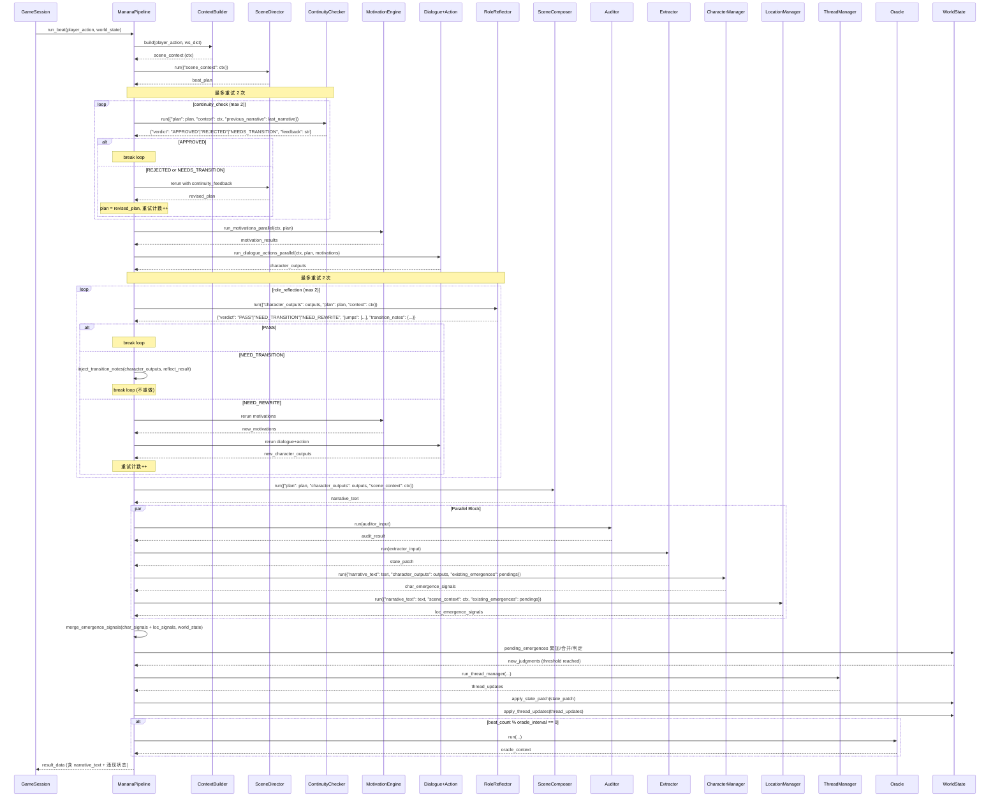
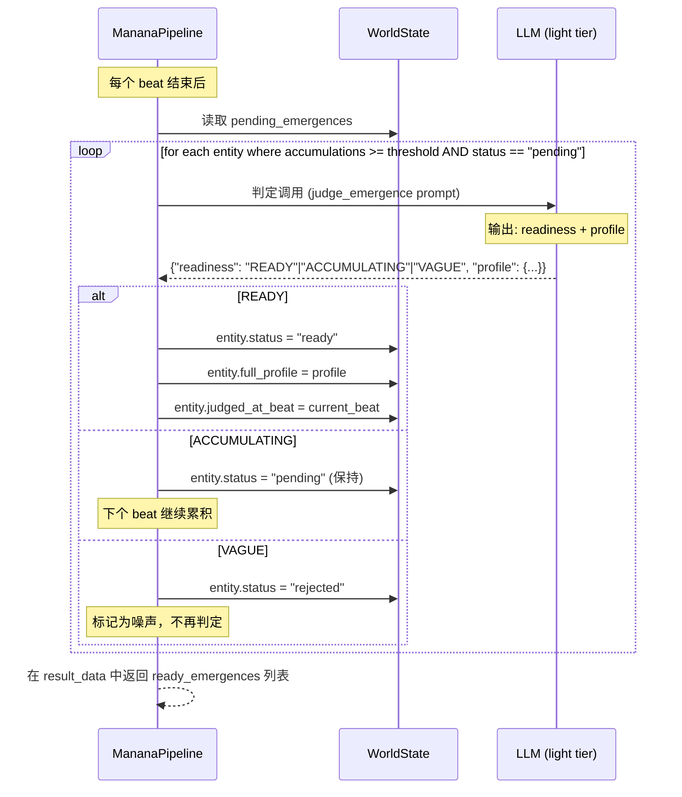

# MaNA v4 增强方案 — 架构设计文档

> 作者: 架构师 Bob  
> 日期: 2025-07-17  
> 状态: 初稿  

---

## 目录

1. [实现方案](#1-实现方案)
2. [框架选型与复用机制](#2-框架选型与复用机制)
3. [文件列表](#3-文件列表)
4. [数据结构和接口](#4-数据结构和接口)
5. [程序调用流程](#5-程序调用流程)
6. [任务列表（含依赖关系）](#6-任务列表含依赖关系)
7. [依赖包列表](#7-依赖包列表)
8. [共享知识](#8-共享知识)
9. [待明确事项](#9-待明确事项)

---

## 1. 实现方案

### 总览

本次增强在现有 MaNA v4 流水线中插入三个新改动，涉及 **4 个新 Agent**、**2 个反馈回路**、**1 个持久化暂存结构**：

```
现有:   L0 → L1 → L2R1 → L2R2 → L3 → (L3b∥L4a) → L4b → L5
增强:   L0 → L1 → L1b ──→ L2R1 → L2R2 → L2R3 ──→ L3 → (L3b∥L4a + CM + LM) → L4b → L5
              ↑ 反馈回路(max 2)         ↑ 反馈回路(max 2)
                                          L2R3: NEED_REWRITE → 重做 L2R2
                                          L2R3: NEED_TRANSITION → 修正输出后继续
```

---

### 改动一：涌现建议系统 (Emergence System)

#### 实现策略

**新 Agent**: `CharacterManager` + `LocationManager`  
**位置**: 在 L3b∥L4a 并行块中，与 `ConsistencyAuditor` 和 `StateExtractor` 并行运行  
**模型 tier**: 均为 light

**工作流**:

```
每个 beat:
  1. CharacterManager 分析叙事文本 + 角色输出 → 检测"值得关注的角色涌现信号"
     - 现有动态 NPC 的出场频率、互动深度
     - 玩家对该 NPC 的特殊关注
     - NPC 对叙事产生了实质影响
  2. LocationManager 分析叙事文本 → 检测"地点状态变化信号"
     - 地点氛围/状态发生了显著变化
     - 发现了新的地点特征
     - 地点成为了叙事转折的关键场所
  3. 检测结果写入 WorldState.pending_emergences
     → 相同实体累加计数 + 合并上下文
  4. 当 pending_emergences 中某实体的累计出现次数 >= threshold（默认 3）：
     → 触发 LLM 判定（light tier）
     → 输出 readiness: "READY" | "ACCUMULATING" | "VAGUE"
     → 如果 READY：同时输出完整 JSON 档案，由 pipeline 决定是否采纳
     → 如果 ACCUMULATING：保留继续累积
     → 如果 VAGUE：标记为 rejected（噪声）
```

**阈值配置**: 通过 `MananaConfig` 读取，默认 `emergence_threshold: 3`

**采纳时机**: 不在 beat 内自动采纳。由 `run_beat()` 返回 `pending_emergences` 快照，GameSession 在 beat 循环外择机调用 `_resolve_emergences()` 处理。

---

### 改动二：连续叙事审计 (Continuity Checker)

#### 实现策略

**新 Agent**: `ContinuityChecker`  
**位置**: L1 (SceneDirector) → **L1b (ContinuityChecker)** → L2R1 (MotivationEngine)  
**模型 tier**: medium

**反馈回路**:

```
L1 输出 beat_plan
  → L1b 检查: 
     - 与上一 beat 的连贯性（事件衔接、情绪过渡）
     - 与活跃叙事线索的一致性
     - 角色逻辑的延续性
  → 判决:
     - APPROVED → 继续到 L2R1
     - REJECTED → 打回 L1 重做（带反馈信息）
     - NEEDS_TRANSITION → 打回 L1 重做（需要更平滑的过渡）
  → 重做上限: 2 次
  → 超过上限: 强制 APPROVED（防止死循环）
```

**实现方式**: 在 `run_beat()` 中，L1 执行后增加一个 `while` 循环：

```python
continuity_attempt = 0
max_continuity_retries = 2
while continuity_attempt <= max_continuity_retries:
    continuity_result = await self._run_continuity_check(plan, ctx)
    verdict = continuity_result.get("verdict", "APPROVED")
    if verdict == "APPROVED":
        break
    continuity_attempt += 1
    if continuity_attempt > max_continuity_retries:
        log_warning("L1b", "ContinuityChecker 超过重试上限，强制 APPROVED")
        break
    # 将反馈注入 ctx，重新运行 L1
    ctx["continuity_feedback"] = continuity_result.get("feedback", "")
    plan = await self._rerun_director(ctx)  # 重做 L1
```

---

### 改动三：角色过渡反思 (Role Reflector)

#### 实现策略

**新 Agent**: `RoleReflector`  
**位置**: L2R2 (DialogueWeaver+ActionDirector) → **L2R3 (RoleReflector)** → L3 (SceneComposer)  
**模型 tier**: light

**跳跃检测维度**:
- 服装 (clothing): 角色着装是否突然变化且无合理解释
- 位置 (location): 角色位置是否跳跃
- 情绪 (emotion): 情绪转变是否缺乏过渡
- 关系 (relationship): 角色间关系变化是否突兀

**反馈回路**:

```
L2R2 输出 character_outputs
  → L2R3 检查每个出场角色的过渡自然度
  → 判决:
     - PASS → 继续到 L3
     - NEED_TRANSITION → 在 character_outputs 中注入 transition_notes，
       不重做 L2R2，直接继续到 L3（让 Composer 处理过渡）
     - NEED_REWRITE → 打回 L2R2 重做（max 2 次）
  → 重做上限: 2 次
  → 超过上限: 强制 PASS
```

**实现方式**: 在 `run_beat()` 中，L2R2 执行后增加循环：

```python
reflect_attempt = 0
max_reflect_retries = 2
while reflect_attempt <= max_reflect_retries:
    reflect_result = await self._run_role_reflection(character_outputs, ctx, plan)
    verdict = reflect_result.get("verdict", "PASS")
    if verdict == "PASS":
        break
    reflect_attempt += 1
    if reflect_attempt > max_reflect_retries:
        log_warning("L2R3", "RoleReflector 超过重试上限，强制 PASS")
        break
    if verdict == "NEEDS_TRANSITION":
        # 注入 transition_notes，不重做
        character_outputs = self._inject_transition_notes(character_outputs, reflect_result)
        break  # 有 transition_notes 即可继续
    elif verdict == "NEED_REWRITE":
        # 重做 L2R2（Motivation → Dialogue+Action）
        motivation_results = await self._run_motivations_parallel(ctx, plan)
        character_outputs = await self._run_dialogue_actions_parallel(ctx, plan, motivation_results)
```

---

## 2. 框架选型与复用机制

### 无新增外部依赖

本项目使用纯 Python，所有增强均复用现有机制：

| 机制 | 复用方式 |
|------|----------|
| LLM 调用 | 所有新 Agent 继承 `BaseAgent`，复用 `_call_llm()`、`_parse_json_response()` |
| Provider 路由 | 复用 `_get_provider_for_tier()`，ContinuityChecker 用 medium，其余用 light |
| 反馈回路 | 参考现有 `_run_composer_with_refinement()` 的精炼循环模式 |
| 并行执行 | 参考现有 `asyncio.gather()` 模式（L3b∥L4a 的并行块） |
| 配置加载 | 新增 feature flags 通过 `MananaConfig` 读取 |
| 日志/追踪 | 复用 `log_layer()`、`log_warning()`、`log_error()`、`save_traces()` |
| Schema 验证 | 新增输出 schema 在 `MananaSchema` 中注册，复用 `_validate_keys()` |

---

## 3. 文件列表

### 新增文件

```
server/manana/
├── agents/
│   ├── __init__.py              # 新 Agent 包初始化（可选）
│   ├── continuity_checker.py    # L1b ContinuityChecker Agent
│   ├── role_reflector.py        # L2R3 RoleReflector Agent
│   ├── character_manager.py     # L3b∥ CharacterManager (Emergence)
│   └── location_manager.py      # L3b∥ LocationManager (Emergence)
```

> **设计决策**: 新 Agent 放到独立的 `agents/` 子包中，避免 `agents.py` 文件过度膨胀。现有 Agent 不动，通过 pipeline.py 的 import 方式统一引用。

### 修改文件

```
server/manana/
├── pipeline.py                  # 主流水线：插入 L1b、L2R3、CM/LM 调用 + 反馈回路
├── schema.py                    # 新增 MananaSchema 输出 key 定义 + validator
├── config.py                    # 新增 emergence / continuity / reflection 配置项

server/
├── world_state.py               # 新增 pending_emergences 属性 + 操作方法
```

### 文件依赖图

```
world_state.py  ←── pipeline.py ──→ agents/*.py
                      ↕                 ↕
                  config.py         schema.py
```

---

## 4. 数据结构和接口

### 4.1 新增数据结构

#### WorldState.pending_emergences

```python
# world_state.py 新增属性
self.pending_emergences: dict[str, PendingEntity] = {}
# key: entity_id (如 "dyn_图书馆管理员" 或 "loc_图书馆_秘密书架")
```

#### PendingEntity 定义

```python
@dataclass
class PendingEntity:
    """一个待判定的涌现实体"""
    id: str                          # 唯一标识
    entity_type: str                 # "character" | "location"
    name: str                        # 显示名称
    accumulations: int               # 累计出现次数
    first_seen_beat: str             # 首次出现的 beat_id
    last_seen_beat: str              # 最近出现的 beat_id
    accumulated_context: list[str]   # 每次出现时积累的上下文摘要
    status: str                      # "pending" | "ready" | "adopted" | "rejected"
    readiness: str = ""              # LLM 判定结果: "READY"|"ACCUMULATING"|"VAGUE"
    full_profile: dict = None        # LLM 输出的完整 JSON 档案（READY 时填充）
    judged_at_beat: str = ""         # 判定发生的 beat_id
```

### 4.2 新增 Agent 接口

#### ContinuityChecker (L1b)

```python
class ContinuityChecker(BaseAgent):
    agent_name: str = "ContinuityChecker"
    model_tier: str = "medium"

    async def run(self, input_data: dict) -> dict:
        """检查节拍计划的连续性。
        
        Input:
            plan: dict  — L1 SceneDirector 输出的 beat_plan
            scene_context: dict — L0 构建的场景上下文
            previous_narrative: str — 上一拍的叙事文本
            continuity_feedback: str — 上次打回的反馈（首次为空）
        
        Returns:
            {
                "ok": True/False,
                "verdict": "APPROVED" | "REJECTED" | "NEEDS_TRANSITION",
                "feedback": "详细的连续性问题和修改建议",
                "issues": [{"dimension": str, "description": str, "severity": str}],
                "raw": dict
            }
        """
```

#### RoleReflector (L2R3)

```python
class RoleReflector(BaseAgent):
    agent_name: str = "RoleReflector"
    model_tier: str = "light"

    async def run(self, input_data: dict) -> dict:
        """检查角色过渡的自然度。
        
        Input:
            character_outputs: list[dict] — L2R2 输出的角色对话+动作
            plan: dict — L1 beat_plan
            scene_context: dict — 场景上下文
        
        Returns:
            {
                "ok": True/False,
                "verdict": "PASS" | "NEED_TRANSITION" | "NEED_REWRITE",
                "jumps": [
                    {
                        "char_id": str,
                        "dimension": "clothing" | "location" | "emotion" | "relationship",
                        "description": str,
                        "severity": "minor" | "major",
                        "transition_suggestion": str
                    }
                ],
                "transition_notes": {char_id: {"dimension": str, "note": str}},
                "raw": dict
            }
        """
```

#### CharacterManager (L3b∥)

```python
class CharacterManager(BaseAgent):
    agent_name: str = "CharacterManager"
    model_tier: str = "light"

    async def run(self, input_data: dict) -> dict:
        """检测涌现角色候选。
        
        Input:
            narrative_text: str — L3 叙事文本
            character_outputs: list[dict] — L2R2 角色输出
            existing_emergences: dict — WorldState.pending_emergences 快照
            existing_dynamic_npcs: dict — WorldState.dynamic_npcs
        
        Returns:
            {
                "ok": True/False,
                "emergence_signals": [
                    {
                        "entity_id": str,
                        "entity_type": "character",
                        "name": str,
                        "relevance": float,        # 0.0~1.0
                        "context_summary": str,    # 本次出现的上下文
                        "evidence": str            # 文本证据
                    }
                ],
                "raw": dict
            }
        """
```

#### LocationManager (L3b∥)

```python
class LocationManager(BaseAgent):
    agent_name: str = "LocationManager"
    model_tier: str = "light"

    async def run(self, input_data: dict) -> dict:
        """检测地点涌现信号。
        
        Input:
            narrative_text: str
            scene_context: dict — 含 location 信息
            existing_emergences: dict
        
        Returns:
            {
                "ok": True/False,
                "emergence_signals": [
                    {
                        "entity_id": str,
                        "entity_type": "location",
                        "name": str,
                        "relevance": float,
                        "context_summary": str,
                        "evidence": str
                    }
                ],
                "raw": dict
            }
        """
```

### 4.3 新增 schema 定义（MananaSchema）

```python
# 新增到 schema.py

# ContinuityChecker 输出 key
CONTINUITY_OUTPUT_KEYS = ["verdict", "feedback", "issues"]

# RoleReflector 输出 key
REFLECTOR_OUTPUT_KEYS = ["verdict", "jumps", "transition_notes"]

# CharacterManager 输出 key
CHARACTER_MANAGER_OUTPUT_KEYS = ["emergence_signals"]

# LocationManager 输出 key
LOCATION_MANAGER_OUTPUT_KEYS = ["emergence_signals"]

# Emergence judgment (LLM 判定) 输出 key
EMERGENCE_JUDGMENT_OUTPUT_KEYS = ["readiness", "profile"]
```

### 4.4 Pipeline 新增方法

```python
# 新增到 MananaPipeline

async def _run_continuity_check(self, plan: dict, ctx: dict) -> dict
    """创建 ContinuityChecker 并运行"""
    
async def _rerun_director(self, ctx: dict) -> dict
    """根据连续性反馈重新运行 L1 SceneDirector"""
    
async def _run_role_reflection(self, character_outputs: list, ctx: dict, plan: dict) -> dict
    """创建 RoleReflector 并运行"""
    
def _inject_transition_notes(self, character_outputs: list, reflect_result: dict) -> list
    """在 character_outputs 中注入 transition_notes"""

async def _run_character_manager(self, narrative_text: str, character_outputs: list, ws_dict: dict) -> dict
    """运行 CharacterManager，返回涌现信号"""
    
async def _run_location_manager(self, narrative_text: str, ctx: dict, ws_dict: dict) -> dict
    """运行 LocationManager，返回涌现信号"""
    
async def _judge_emergence(self, entity: PendingEntity, ws_dict: dict) -> dict
    """对达到阈值的涌现候选进行 LLM 判定，返回 readiness + profile"""
    
def _merge_emergence_signals(self, signals: list[dict], world_state: "WorldState") -> None
    """将涌现信号合并到 WorldState.pending_emergences"""
    
def _check_and_judge_emergences(self, world_state: "WorldState") -> list[dict]
    """检查哪些候选达到阈值，触发 LLM 判定，返回新判定结果"""
```

### 4.5 Config 新增配置项

```python
# config.py 新增配置段

# 在 _populate_from_yaml() 中新增:
# emergence 配置
self._config.add_section("emergence")
self._config.set("emergence", "enabled", "true" if features.get("emergence", True) else "false")
self._config.set("emergence", "threshold", str(features.get("emergence_threshold", 3)))

# continuity_checker 配置
self._config.add_section("continuity_checker")
self._config.set("continuity_checker", "enabled", "true" if features.get("continuity_checker", True) else "false")
self._config.set("continuity_checker", "max_retries", "2")

# role_reflector 配置
self._config.add_section("role_reflector")
self._config.set("role_reflector", "enabled", "true" if features.get("role_reflector", True) else "false")
self._config.set("role_reflector", "max_retries", "2")

# 新增 getter 方法
def get_emergence_config(self) -> dict: ...
def get_continuity_config(self) -> dict: ...
def get_role_reflector_config(self) -> dict: ...
```

---

## 5. 程序调用流程

### 5.1 run_beat 完整流程（Mermaid 时序图）



### 5.2 涌现判定流程（独立时序）



---

## 6. 任务列表（含依赖关系）

### 总任务数量：5 个（硬上限）

```
T01: 项目基础设施（WorldState + Config + Schema 扩展）
├── 被 T02 依赖
├── 被 T03 依赖
├── 被 T04 依赖
└── 被 T05 依赖

T02: L1b ContinuityChecker + 反馈回路
├── 依赖 T01
└── 被 T05 依赖

T03: L2R3 RoleReflector + 反馈回路
├── 依赖 T01
└── 被 T05 依赖

T04: 涌现系统（CharacterManager + LocationManager + pending_emergences）
├── 依赖 T01
└── 被 T05 依赖

T05: 流水线集成 + 路由 + 配置 + 最终调试
├── 依赖 T02
├── 依赖 T03
└── 依赖 T04
```

---

### 详细任务定义

#### T01: 项目基础设施（WorldState + Config + Schema 扩展）

| 字段 | 内容 |
|------|------|
| **任务 ID** | T01 |
| **任务名称** | 项目基础设施扩展 — WorldState/Config/Schema |
| **源文件** | `server/world_state.py`, `server/manana/config.py`, `server/manana/schema.py` |
| **依赖** | 无 |
| **优先级** | P0 |
| **说明** | 在所有新 Agent 编写前，先扩展基础数据结构：<br><br>**world_state.py**:<br>- 新增 `pending_emergences: dict[str, PendingEntity]` 属性<br>- 新增 `PendingEntity` dataclass（在文件顶部定义）<br>- 新增 `add_emergence_signal()` 方法<br>- 新增 `get_pending_emergences_snapshot()` 方法<br>- 新增 `update_emergence_status()` 方法<br>- 在 `to_dict()`/`from_dict()` 中序列化/反序列化<br><br>**config.py**:<br>- 新增 `emergence` 配置段 + `get_emergence_config()`<br>- 新增 `continuity_checker` 配置段 + `get_continuity_config()`<br>- 新增 `role_reflector` 配置段 + `get_role_reflector_config()`<br><br>**schema.py**:<br>- 新增 `CONTINUITY_OUTPUT_KEYS` + `_CONTINUITY_TYPE_MAP`<br>- 新增 `REFLECTOR_OUTPUT_KEYS` + `_REFLECTOR_TYPE_MAP`<br>- 新增 `CHARACTER_MANAGER_OUTPUT_KEYS`<br>- 新增 `LOCATION_MANAGER_OUTPUT_KEYS`<br>- 新增 `EMERGENCE_JUDGMENT_OUTPUT_KEYS`<br>- 新增对应的 `validate_*()` 方法 |

---

#### T02: L1b ContinuityChecker + 反馈回路

| 字段 | 内容 |
|------|------|
| **任务 ID** | T02 |
| **任务名称** | L1b ContinuityChecker Agent + L1 重做回路 |
| **源文件** | `server/manana/agents/continuity_checker.py` (新增), `server/manana/pipeline.py` (修改) |
| **依赖** | T01 |
| **优先级** | P0 |
| **说明** | <br><br>**continuity_checker.py** (新增):<br>- `class ContinuityChecker(BaseAgent)`<br>- `agent_name = "ContinuityChecker"`, `model_tier = "medium"`<br>- `build_system_prompt()` — 中文 prompt，要求检查：与上一拍的连续性、线索一致性、角色逻辑延续性<br>- `build_user_prompt()` — 构造检查输入（plan + scene_context + previous_narrative）<br>- `run()` — 调用 LLM → 解析 → 返回 {"verdict", "feedback", "issues"}<br><br>**pipeline.py** (修改):<br>- 导入 `ContinuityChecker`<br>- 在 `run_beat()` 中 L1 之后插入连续审计循环：<br>  - `_run_continuity_check(plan, ctx) → dict`<br>  - `_rerun_director(ctx) → dict`<br>  - 循环控制 (max 2 次)<br>  - 超过上限强制 APPROVED<br>- 通过 `self._config.is_feature_enabled("continuity_checker")` 控制开关 |

---

#### T03: L2R3 RoleReflector + 反馈回路

| 字段 | 内容 |
|------|------|
| **任务 ID** | T03 |
| **任务名称** | L2R3 RoleReflector Agent + L2R2 重做回路 |
| **源文件** | `server/manana/agents/role_reflector.py` (新增), `server/manana/pipeline.py` (修改) |
| **依赖** | T01 |
| **优先级** | P0 |
| **说明** | <br><br>**role_reflector.py** (新增):<br>- `class RoleReflector(BaseAgent)`<br>- `agent_name = "RoleReflector"`, `model_tier = "light"`<br>- `build_system_prompt()` — 中文 prompt，要求检测四维跳跃（服装/位置/情绪/关系）<br>- `build_user_prompt()` — 构造输入（character_outputs + plan + scene_context）<br>- `run()` — 调用 LLM → 解析 → 返回 {"verdict", "jumps", "transition_notes"}<br><br>**pipeline.py** (修改):<br>- 导入 `RoleReflector`<br>- 在 `run_beat()` 中 L2R2 之后插入反思循环：<br>  - `_run_role_reflection(character_outputs, ctx, plan) → dict`<br>  - `_inject_transition_notes(character_outputs, reflect_result) → list`<br>  - 循环控制 (max 2 次, NEED_TRANSITION 不重做)<br>  - 超过上限强制 PASS<br>- 通过 `self._config.is_feature_enabled("role_reflector")` 控制开关 |

---

#### T04: 涌现系统（CharacterManager + LocationManager + pending_emergences）

| 字段 | 内容 |
|------|------|
| **任务 ID** | T04 |
| **任务名称** | 涌现建议系统 — CharacterManager + LocationManager + LLM 判定 |
| **源文件** | `server/manana/agents/character_manager.py` (新增), `server/manana/agents/location_manager.py` (新增), `server/manana/pipeline.py` (修改), `server/world_state.py` (已由 T01 修改) |
| **依赖** | T01 |
| **优先级** | P0 |
| **说明** | <br><br>**character_manager.py** (新增):<br>- `class CharacterManager(BaseAgent)`, tier: light<br>- 分析叙事文本，检测值得关注的新角色/动态 NPC<br>- 输出 `emergence_signals` 列表<br><br>**location_manager.py** (新增):<br>- `class LocationManager(BaseAgent)`, tier: light<br>- 分析叙事文本，检测地点状态变化/新地点特征<br>- 输出 `emergence_signals` 列表<br><br>**pipeline.py** (修改):<br>- 导入 `CharacterManager`, `LocationManager`<br>- 在 L3b∥L4a 并行块中添加 CM + LM 运行<br>- `_merge_emergence_signals()` — 将信号合并到 WorldState<br>- `_check_and_judge_emergences()` — 检查阈值，触发 LLM 判定<br>- 判断 prompt 为内联实现（不单独成 Agent），复用 light provider<br>- 在 result_data 中添加 `ready_emergences` 字段返回已就绪的涌现实体<br>- 通过 `self._config.is_feature_enabled("emergence")` 控制开关 |

---

#### T05: 流水线集成 + 路由 + 配置 + 最终调试

| 字段 | 内容 |
|------|------|
| **任务 ID** | T05 |
| **任务名称** | 流水线集成 — 完整 run_beat 编排 + import + 路由 + config.yaml |
| **源文件** | `server/manana/pipeline.py` (修改), `server/manana/config.py` (修改), `config.yaml` (修改) |
| **依赖** | T02, T03, T04 |
| **优先级** | P0 |
| **说明** | <br><br>**pipeline.py** (最终集成):<br>- 确保所有 import 正确（4 个新 Agent）<br>- 确保 `run_beat()` 中三处插入点的循环控制逻辑正确<br>- 确保反馈回路不会无限循环（上限检查）<br>- 确保涌现判定在异步上下文中正确调用<br>- 确保 result_data 包含 `pending_emergences` 快照<br>- 日志输出：每个新 Agent 的开始/完成/重试/超限<br>- progress_cb 回调：新增涌现阶段的状态推送<br><br>**config.py** (修改):<br>- 在 `_populate_from_yaml()` 中读入三个新功能的 feature flag<br>- 在 `is_feature_enabled()` 中注册新功能名<br><br>**config.yaml** (修改):<br>- 在 `features:` 下新增：<br>  ```yaml
features:
  ...
  emergence: true
  emergence_threshold: 3
  continuity_checker: true
  role_reflector: true
  ```<br><br>**最终调试**:<br>- 验证三个新功能各自开关正常<br>- 验证反馈回路在 2 次上限后强制放行<br>- 验证涌现信号正确累加和判定<br>- 验证无新增外部依赖 |

---

## 7. 依赖包列表

无新增第三方依赖。所有功能复用现有包：

| 包名 | 版本 | 用途 |
|------|------|------|
| Python 标准库 `asyncio` | 内置 | 异步并行执行 Agent |
| Python 标准库 `copy` | 内置 | 深拷贝上下文 |
| Python 标准库 `logging` | 内置 | 日志 |
| Python 标准库 `dataclasses` | 内置 (3.7+) | PendingEntity 数据类 |
| `typing` | 内置 | 类型标注 |

**说明**: 本项目运行在 Python 3.10+ 环境，`dataclasses` 和 `typing` 均为标准库。

---

## 8. 共享知识

### 8.1 Agent 编码规范

1. **所有新 Agent 必须继承 `BaseAgent`**，实现 `build_system_prompt()`、`build_user_prompt()`、`run()` 三个抽象方法。
2. **Agent 不持有 WorldState 引用**。所有数据通过 `input_data` dict 传入，结果通过 dict 返回。
3. **`run()` 返回值格式统一**: `{"ok": bool, "content": str, "raw": dict, "error": str}`。
4. **Agent 不自行创建 Provider**。Provider 由 Pipeline 通过 `agent.configure(provider)` 注入。

### 8.2 反馈回路约定

1. **上限保护**: 所有反馈回路必须有硬性上限（max_retries），超过上限后强制通过。
2. **上下文注入**: 打回重做时，反馈信息通过 `ctx["continuity_feedback"]` 或类似 key 注入。
3. **日志记录**: 每次重试必须记录 `log_warning()`，超限时记录 `log_error()`。
4. **状态回滚**: 重做 L2R2 时，必须先重做 L2R1（Motivation 是 Dialogue+Action 的前置依赖）。

### 8.3 涌现系统约定

1. **`pending_emergences` 不序列化到前端**。在 `WorldState.to_dict()` 中**排除**该字段。
2. **LLM 判定在 pipeline 内部完成**，不单独创建 Agent 类。使用 `_run_emergence_judgment()` 辅助方法。
3. **阈值默认 3**，可通过 `config.yaml` 的 `emergence_threshold` 配置。
4. **涌现判定不阻塞 beat 完成**。判定在 merge 阶段同步触发，但 result_data 仅携带状态快照。

### 8.4 配置约定

1. **所有新功能默认开启**（`enabled: true`）。
2. **功能开关使用 `MananaConfig.is_feature_enabled("feature_name")`** 检查。
3. **配置键名使用 snake_case**，与现有风格一致。

### 8.5 文件组织约定

1. 新 Agent 放在 `server/manana/agents/` 子包中。
2. `server/manana/agents/__init__.py` 导出所有新 Agent 类（用于 pipeline.py 的整洁导入）。
3. 流水线逻辑（循环、路由）在 `pipeline.py` 中，Agent 类不包含任何编排逻辑。

### 8.6 并行执行约定

1. L3b∥L4a 并行块使用 `asyncio.gather()` 同时运行 Auditor、Extractor、CharacterManager、LocationManager。
2. 每个并行 Agent 使用独立的 Provider 实例（通过 `_create_independent_provider()` 创建），完成后调用 `provider.cleanup()`。
3. CharacterManager 和 LocationManager 使用 light tier provider。

---

## 9. 待明确事项

### 9.1 涌现判决后的采纳时机

**问题**: LLM 判定为 "READY" 的涌现实体，何时/如何被采纳？谁来决定将其真正应用到世界状态中？

**当前假设**: 
- Pipeline 在 `run_beat()` 的 result_data 中返回 `ready_emergences` 列表
- GameSession 在 beat 循环外择机调用共识决方法（如 `_resolve_emergences()`）
- 具体采纳逻辑（如：自动采纳 / 需要人工确认 / 在特定叙事节点触发）超出本次架构范围，由 GameSession 层决定

### 9.2 L2R3 NEED_TRANSITION 的传递方式

**问题**: `NEED_TRANSITION` 判决下，`transition_notes` 如何传入 L3 Composer？

**当前假设**: 
- `transition_notes` 以 `{"char_id": {"dimension": "emotion", "note": "从愤怒到忧虑的转变需要中间情绪"}}` 格式注入到 character_outputs 每项的 `transition_notes` 字段中
- L3 Composer 的 `build_user_prompt()` 需要读取该字段并在叙事中体现过渡
- Composer 的 prompt 是否需要更新以支持 transition_notes？**需要确认**

### 9.3 ContinuityChecker 的输入范围

**问题**: ContinuityChecker 需要检查"与上一拍的连续性"，但 Plan（beat_plan）本身不包含上一拍的叙事文本。

**当前假设**:
- Pipeline 在 `_run_continuity_check()` 中将 `self._last_narrative` 作为 `previous_narrative` 传入
- 同时也传入 `continuity_feedback`（如有）

### 9.4 配置项默认值

**问题**: 新增配置项的默认值需要在 `MananaConfig` 中确定：

| 配置项 | 建议默认值 | 说明 |
|--------|-----------|------|
| `emergence.enabled` | `true` | 涌现系统开关 |
| `emergence.threshold` | `3` | 触发 LLM 判定的出现次数阈值 |
| `continuity_checker.enabled` | `true` | 连续审计开关 |
| `continuity_checker.max_retries` | `2` | 重做上限 |
| `role_reflector.enabled` | `true` | 角色反思开关 |
| `role_reflector.max_retries` | `2` | 重做上限 |

### 9.5 progress_cb 回调

**问题**: 新 Agent 运行期间是否需要通过 `progress_cb` 向前端推送状态？

**当前假设**: 
- L1b 和 L2R3 因为是反馈回路（可能无感），不需要额外的 progress_cb
- CM/LM 是并行块的一部分，可以使用已有的 "auditor" 状态位覆盖，或者新增独立的 "emergence" 状态位
- **需要确认**是否新增 progress_cb 状态位
